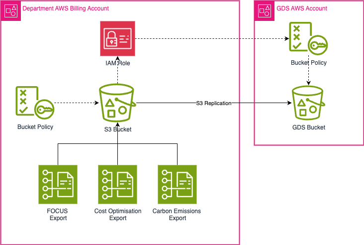

# terraform-aws-focus

[](LICENCE)

A Terraform module for exporting:
* [FOCUS](https://focus.finops.org/) (FinOps Open Cost and Usage Specification).
* [Cost Optimisation recommendations](https://aws.amazon.com/blogs/aws-cloud-financial-management/generate-your-cost-optimization-reports-with-data-exports-for-cost-optimization-hub/).
* [Carbon Emissions data](https://aws.amazon.com/blogs/aws-cloud-financial-management/export-and-visualize-carbon-emissions-data-from-your-aws-accounts/).

Exports are delivered to an S3 bucket, which replicates securely to Government Digital Services (GDS), over the AWS internal network.

The encrypted (SSE-S3) S3 bucket has the following:
* Bucket Policy which grants permissions to the BCM Data Exports service to write the report data files.
* Lifecycle Policy which removes non-current versions after 1 day. Latest versions are kept for 7 days before being removed.
* Service Linked IAM role allowing the S3 service to read objects from the bucket and replicate them to the destination bucket.
* Replication rule that uses the IAM role above to do the replication. The IAM role is authorised on the destination GDS S3 bucket to allow the sender to only replicate the data, and to an isolated drop-zone.



## Review
[@jonodrew](https://github.com/jonodrew) reviewed this package on 2025-02-13 and found no significant concerns. The package:

1. Creates a new S3 bucket for storing cost exports
2. Sets up replication to a central S3 bucket
3. Sets up AWS cost exports to create a daily report and store it in the bucket created in step 1
4. Sets up a cleanup on the bucket to remove old / deleted files after 7 days

The Bucket's Role has permissions to replicate any Object that is put in it, so hosting teams must ensure that nothing is accidentally placed there. 

If this library is deployed through a continuous deployment (CD) pipeline, deploying teams should thoroughly check any changes to this codebase before they are deployed. 

## Bucket Policy

The module creates an S3 bucket policy that grants the BCM Data Exports service the permissions it needs to write report data. This policy is always present and cannot be removed.

### Default behaviour

By default, the module applies only the BCM grant. Upgrading to a new version of the module will not change this policy — existing deployments see no Terraform plan changes.

### Recommended: adding statements via the module

Use `additional_policy_statements` to add your own IAM statements on top of the default BCM grant. This is the recommended approach — it avoids creating a second `aws_s3_bucket_policy` resource that would conflict with the module's own.

Example — adding `DenyNonSSLRequests`:

```hcl
module "focus" {
  source = "github.com/co-cddo/terraform-aws-focus?ref=..."

  destination_account_id  = var.cddo_destination_account_id
  destination_bucket_name = var.cddo_destination_bucket_name

  additional_policy_statements = [
    {
      sid       = "DenyNonSSLRequests"
      effect    = "Deny"
      actions   = ["s3:*"]
      resources = [
        "arn:aws:s3:::my-bucket",
        "arn:aws:s3:::my-bucket/*",
      ]
      principals = {
        type        = "*"
        identifiers = ["*"]
      }
      conditions = [
        {
          test     = "Bool"
          variable = "aws:SecureTransport"
          values   = ["false"]
        }
      ]
    }
  ]
}
```

All fields in each statement object are required. Use `sid = ""` if you don't need a statement ID, and `conditions = []` if you have no conditions.

> **Note:** Invalid ARNs in `resources` or `principals.identifiers` will not cause `terraform plan` to fail — they will be rejected by AWS at `terraform apply` time.

### Hardening deny statements

Set `enforce_secure_defaults = true` to add pre-built hardening to the bucket. Currently includes:

- `DenyNonSSLRequests` — denies all S3 actions over non-HTTPS connections (bucket policy)
- Public access block — enables all four settings (`block_public_acls`, `block_public_policy`, `ignore_public_acls`, `restrict_public_buckets`)

**This variable defaults to `false` for backward compatibility. It will default to `true` in a future major release.** Teams are encouraged to opt in now.

```hcl
module "focus" {
  source = "github.com/co-cddo/terraform-aws-focus?ref=..."

  destination_account_id  = var.cddo_destination_account_id
  destination_bucket_name = var.cddo_destination_bucket_name

  enforce_secure_defaults = true
}
```

### Legacy: external `aws_s3_bucket_policy` resource

If you currently manage your own `aws_s3_bucket_policy` resource targeting the module's bucket, this continues to work. However, Terraform will conflict if both your resource and the module attempt to manage the same bucket policy. To migrate to the recommended approach:

1. Move your custom statements into `additional_policy_statements` on the module
2. Remove your external `aws_s3_bucket_policy` resource from your configuration
3. Run `terraform state rm aws_s3_bucket_policy.<your_resource_name>` to remove it from state
4. Run `terraform plan` — you should see the policy updated in-place with no destruction

## Features

* Creates AWS Billing & Cost Management data exports for FOCUS, Carbon Emission and Cost Optimisation.
* Creates an S3 Bucket storing export data in the AWS account.
* Configures replication to a GDS managed destination S3 Bucket.
* Creates a service-link IAM Role for use in replication to GDS.
* Enables versioning and encryption for data at rest within the S3 bucket.
* Configures an S3 Bucket Lifecycle Policy to ensure data is not retained longer than neccesary.

## Prerequisites

Terraform 1.0+

AWS CLI configured with appropriate permissions

An IAM role with sufficient permissions to create and manage S3 buckets and replication rules, and AWS BCM data exports.

## Providers

| Name | Version |
|------|---------|
| <a name="provider_aws"></a> [aws](#provider\_aws) | n/a |

## Modules

No modules.

## Resources

| Name | Type |
|------|------|
| [aws_bcmdataexports_export.carbon](https://registry.terraform.io/providers/hashicorp/aws/latest/docs/resources/bcmdataexports_export) | resource |
| [aws_bcmdataexports_export.focus](https://registry.terraform.io/providers/hashicorp/aws/latest/docs/resources/bcmdataexports_export) | resource |
| [aws_bcmdataexports_export.recommendations](https://registry.terraform.io/providers/hashicorp/aws/latest/docs/resources/bcmdataexports_export) | resource |
| [aws_iam_role.this](https://registry.terraform.io/providers/hashicorp/aws/latest/docs/resources/iam_role) | resource |
| [aws_iam_role_policy.replicator](https://registry.terraform.io/providers/hashicorp/aws/latest/docs/resources/iam_role_policy) | resource |
| [aws_iam_service_linked_role.bcm_data_exports](https://registry.terraform.io/providers/hashicorp/aws/latest/docs/resources/iam_service_linked_role) | resource |
| [aws_s3_bucket.this](https://registry.terraform.io/providers/hashicorp/aws/latest/docs/resources/s3_bucket) | resource |
| [aws_s3_bucket_lifecycle_configuration.this](https://registry.terraform.io/providers/hashicorp/aws/latest/docs/resources/s3_bucket_lifecycle_configuration) | resource |
| [aws_s3_bucket_policy.this](https://registry.terraform.io/providers/hashicorp/aws/latest/docs/resources/s3_bucket_policy) | resource |
| [aws_s3_bucket_replication_configuration.this](https://registry.terraform.io/providers/hashicorp/aws/latest/docs/resources/s3_bucket_replication_configuration) | resource |
| [aws_s3_bucket_public_access_block.this](https://registry.terraform.io/providers/hashicorp/aws/latest/docs/resources/s3_bucket_public_access_block) | resource |
| [aws_s3_bucket_versioning.this](https://registry.terraform.io/providers/hashicorp/aws/latest/docs/resources/s3_bucket_versioning) | resource |
| [aws_caller_identity.this](https://registry.terraform.io/providers/hashicorp/aws/latest/docs/data-sources/caller_identity) | data source |
| [aws_iam_policy_document.bucket](https://registry.terraform.io/providers/hashicorp/aws/latest/docs/data-sources/iam_policy_document) | data source |
| [aws_iam_policy_document.replicator](https://registry.terraform.io/providers/hashicorp/aws/latest/docs/data-sources/iam_policy_document) | data source |
| [aws_iam_policy_document.replicator_assume](https://registry.terraform.io/providers/hashicorp/aws/latest/docs/data-sources/iam_policy_document) | data source |

## Inputs

| Name | Description | Type | Default | Required |
|------|-------------|------|---------|:--------:|
| <a name="input_additional_policy_statements"></a> [additional\_policy\_statements](#input\_additional\_policy\_statements) | Additional IAM policy statements to include in the S3 bucket policy. All fields are required. Statements are appended to the default BCM grant and cannot replace or remove it. | `list(object(...))` | `[]` | no |
| <a name="input_bucket_name"></a> [bucket\_name](#input\_bucket\_name) | The name of the S3 bucket to be created to store reports before replication. If omitted it will create one for you. | `string` | `null` | no |
| <a name="input_bucket_tags"></a> [bucket\_tags](#input\_bucket\_tags) | Map of tags to be associated with the reporting bucket | `map(string)` | `{}` | no |
| <a name="input_create_cost_recommendations_service_linked_role"></a> [create\_cost\_recommendations\_service\_linked\_role](#input\_create\_cost\_recommendations\_service\_linked\_role) | Enables the creation of the required service-linked role for data exports to access cost optimisation hub | `bool` | `false` | no |
| <a name="input_destination_account_id"></a> [destination\_account\_id](#input\_destination\_account\_id) | The account ID of the destination S3 bucket where reports will be replicated to. This will be provided as part of the onboarding process. | `string` | n/a | yes |
| <a name="input_destination_bucket_name"></a> [destination\_bucket\_name](#input\_destination\_bucket\_name) | The name of the destination S3 bucket where reports will be replicated to. This will be provided as part of the onboarding process. | `string` | n/a | yes |
| <a name="input_enable_carbon_export"></a> [enable\_carbon\_export](#input\_enable\_carbon\_export) | Enables the collection of carbon footprint report | `bool` | `true` | no |
| <a name="input_enforce_secure_defaults"></a> [enforce\_secure\_defaults](#input\_enforce\_secure\_defaults) | When true, adds hardening to the bucket: denies non-SSL requests via bucket policy and enables all four public access block settings. Defaults to false for backward compatibility. Will default to true in a future major release. | `bool` | `false` | no |
| <a name="input_enable_cost_recommendations_export"></a> [enable\_cost\_recommendations\_export](#input\_enable\_cost\_recommendations\_export) | Enables the collection of cost recommendations report | `bool` | `true` | no |
| <a name="input_tags"></a> [tags](#input\_tags) | Tags to apply to all resources created by this module. | `map(string)` | `{}` | no |

## Outputs

| Name | Description |
|------|-------------|
| <a name="output_bucket_arn"></a> [bucket\_arn](#output\_bucket\_arn) | The ARN of the bucket created to store reports before replicating to GDS |
| <a name="output_replication_role_arn"></a> [replication\_role\_arn](#output\_replication\_role\_arn) | The ARN of the role used to replicate data from the source account to the destination account |

## Support and contact

This module is maintained by the [OCTO Observability team](https://github.com/orgs/co-cddo/teams/octo-observability) at the Department for Science, Innovation & Technology.

- **Questions or issues:** [Open a GitHub issue](../../issues/new).
- **Contributing:** See [CONTRIBUTING.md](CONTRIBUTING.md).
- **Security concerns:** See [SECURITY.md](SECURITY.md).

## Licence

Unless stated otherwise, the codebase is released under the [MIT Licence](LICENCE).
This covers both the codebase and any sample code in the documentation.
The documentation is © Crown copyright and available under the terms of the
[Open Government Licence v3.0](https://www.nationalarchives.gov.uk/doc/open-government-licence/version/3/).
